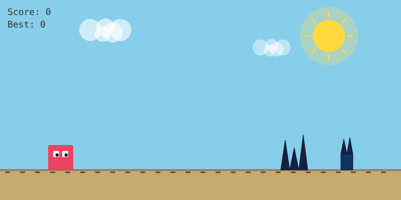
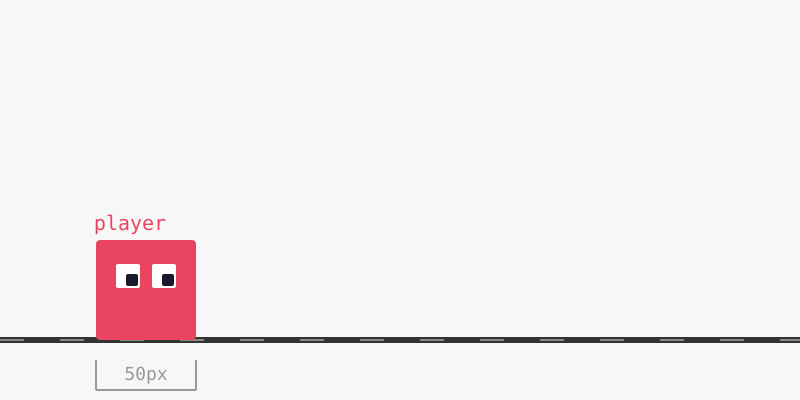
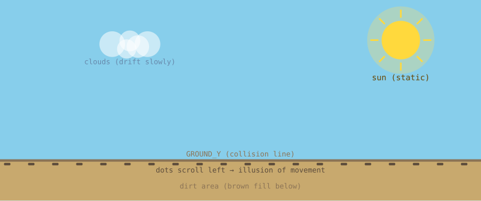
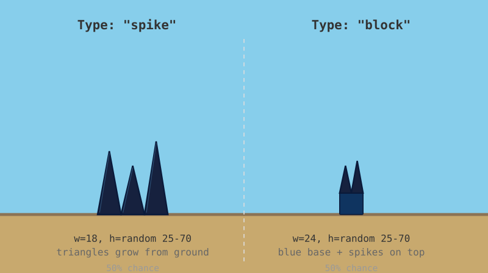
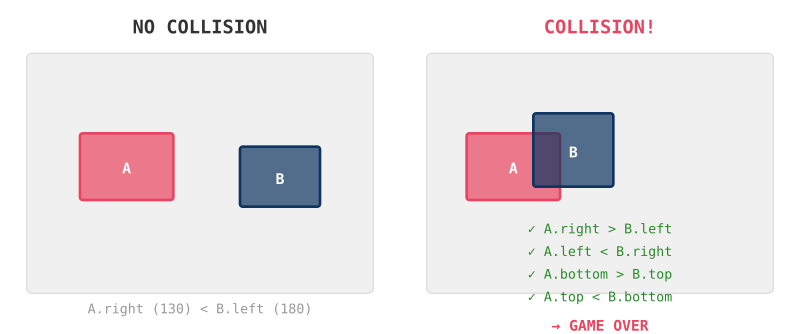

# Make the Chrome dino game (but in HTML, from scratch)

You know the game. WiFi dies, Chrome shows you a pixel dinosaur, you press space and jump over cacti until you inevitably eat it. We're gonna build that exact thing — except our "dino" is a red square with derpy eyes because we're keeping it simple. One file, zero installs, open it and play.



---

## Wait, how does this even work?

Three things you need to know. If you already get HTML/Canvas/JS, skip ahead.

**HTML** is just the bones of a webpage. `<canvas>` says "drawing area goes here." `<script>` says "code goes here." That's pretty much it. Our whole dino game lives in one `.html` file.

**Canvas** is a blank rectangle. You draw on it with JavaScript — squares, circles, lines, whatever. Every frame we wipe it clean and paint everything again: sky, ground, our little dino guy, the spike obstacles. Repeat 60 times a second and you've got smooth animation.

**JavaScript** makes things move. Gravity pulls the dino down after a jump. Obstacles scroll in from the right. The game checks if you faceplanted into a spike. No build tools, no compilers — the browser just reads and runs it.

**Why no `npm install`?** Because we don't need anything from npm. Canvas and JavaScript are built into every browser since like 2005. No dependencies = nothing to install, nothing to break, nothing that randomly stops working because a package author had a bad day. This runs on your phone, your laptop, your grandma's computer.

---

## The dino game loop

The Chrome dino game works like this: the little guy stands still on the left while the world scrolls past him. Cacti (and later pterodactyls) come from the right. You jump over them. Speed ramps up forever until you crash.

We're doing the same thing. Our dino sits at ~12% from the left edge. Everything else — the ground dots, the spike obstacles — moves left. Your brain reads this as "running to the right."

---

## 1. The skeleton

Make a folder called `dino-runner`. Put this inside as `index.html`:

```html
<!DOCTYPE html>
<html>
<head>
  <meta charset="UTF-8">
  <meta name="viewport" content="width=device-width, initial-scale=1.0, user-scalable=no">
  <title>Dino Runner</title>
  <style>
    * { margin: 0; padding: 0; box-sizing: border-box; }
    html, body { width: 100%; height: 100%; overflow: hidden; background: #1a1a2e; }
    body { display: flex; justify-content: center; align-items: center; }
    canvas { display: block; max-width: 100vw; max-height: 100vh; background: #f7f7f7; }
  </style>
</head>
<body>
<canvas id="game"></canvas>
<script>
  const canvas = document.getElementById('game');
  const ctx = canvas.getContext('2d');
</script>
</body>
</html>
```

The `max-width: 100vw` keeps the canvas from spilling off your phone screen. `user-scalable=no` stops accidental pinch-zooming when you're furiously tapping to jump.

---

## 2. Make the canvas fit any screen + the game clock

The real Chrome dino game adapts to your screen. Ours will too. Instead of hardcoding 800×400, we measure the window:

```js
function resize() {
  const w = Math.min(window.innerWidth, 800);
  const h = w * 0.5;
  canvas.width = w;
  canvas.height = h;
}
window.addEventListener('resize', resize);
resize();
```

Caps at 800px wide max, keeps a 2:1 ratio. On a phone that's roughly 375×187. On desktop 800×400. Everything else in the game scales off these numbers.

**The game clock.** `requestAnimationFrame` is how browsers do smooth animation. It calls your function right before each screen refresh — about 60 times a second. Better than `setInterval` because it syncs with your actual monitor and pauses when you switch tabs (saving battery, which matters for a dino game you play while waiting for WiFi).

**Delta time.** Here's the thing that trips up basically everyone: computers don't all run at the same speed. A 144Hz gaming monitor refreshes more than twice as often as a 60Hz office screen. If your dino moves "5 pixels per frame," he'll sprint on one machine and crawl on another.

The fix: every frame, measure how many seconds actually passed since last time (that's `dt`, delta time), and multiply all movement by it. Same speed on every device.

```js
let lastTime = 0;

function gameLoop(timestamp) {
  if (!lastTime) lastTime = timestamp;
  let dt = (timestamp - lastTime) / 1000;
  if (dt > 0.1) dt = 0.1;  // safety cap for tab switches
  lastTime = timestamp;

  // update(dt) goes here — move stuff
  // draw() goes here — paint stuff

  requestAnimationFrame(gameLoop);
}

requestAnimationFrame(gameLoop);
```

The `dt > 0.1` cap: if you switch tabs and come back 5 seconds later, without this cap the browser dumps a huge `dt` on you and your dino teleports through the floor.

---

## 3. Our dino (okay, it's a square)

The Chrome dino is an actual dinosaur sprite. We're using a red square. Why? Because this tutorial is about the game logic, not about drawing pixel art. Once the game works, swap in whatever character you want.

The dino is just a JavaScript object tracking where it is and whether it's jumping:

```js
let GROUND_Y, player, obstacles, spawnTimer, spawnInterval, gameSpeed;
let score, highScore, gameOver, lastTime;

const GRAVITY = 1800;      // how hard the dino gets pulled down
const JUMP_FORCE = -620;   // how hard he launches upward

function init() {
  GROUND_Y = canvas.height - 60;
  player = {
    x: canvas.width * 0.12,    // dino sits left of center
    y: GROUND_Y - 50,          // feet on the ground
    w: 50, h: 50,
    vy: 0,                     // vertical speed (0 = not moving)
    jumping: false
  };
  obstacles = [];
  spawnTimer = 0;
  spawnInterval = 1.6;
  gameSpeed = 350;
  score = 0;
  highScore = highScore || 0;
  gameOver = false;
  lastTime = 0;
}
init();

// Re-init on window resize (phone rotation)
window.addEventListener('resize', () => { resize(); init(); });
```

On a phone the dino sits at x=45. On desktop at x=96. Always visible, always in roughly the same spot.

The 1800 and -620 numbers aren't sacred — I just messed with them until the jump arc felt like the real Chrome dino. Too much gravity = stubby little hop. Too little = he floats like he's on the moon.

---

## 4. Drawing the dino

A plain red square is depressing. Mine has googly eyes:

```js
function draw() {
  ctx.fillStyle = '#f7f7f7';
  ctx.fillRect(0, 0, canvas.width, canvas.height);

  // Dino body (red square)
  ctx.fillStyle = '#e94560';
  ctx.fillRect(player.x, player.y, player.w, player.h);

  // Googly eyes
  ctx.fillStyle = '#fff';
  ctx.fillRect(player.x + 10, player.y + 12, 12, 12);  // left eye white
  ctx.fillRect(player.x + 28, player.y + 12, 12, 12);  // right eye white
  ctx.fillStyle = '#1a1a2e';
  ctx.fillRect(player.x + 15, player.y + 17, 6, 6);    // left pupil
  ctx.fillRect(player.x + 33, player.y + 17, 6, 6);    // right pupil
}
```

The pupils are deliberately off-center. Gives him this slightly unhinged expression, like he's been running from cacti for too long.



---

## 5. The jump (gravity + launch)

When you press Space (or tap on mobile), the dino gets launched upward. Gravity immediately starts pulling him back down. This creates that nice arc you're used to from the real game.

The math is two lines: gravity changes velocity, velocity changes position.

```js
function update(dt) {
  score += dt * 10;
  gameSpeed = 350 + score * 0.6;

  if (player.jumping) {
    player.vy += GRAVITY * dt;       // gravity pulls vy downward
    player.y += player.vy * dt;      // vy moves the dino

    if (player.y >= GROUND_Y - player.h) {
      player.y = GROUND_Y - player.h;  // landed
      player.jumping = false;
      player.vy = 0;
    }
  }
}
```

Gravity is constant acceleration downward (1800 px/s²). The jump force is an instantaneous -620 px/s upward. Together they trace a parabola — same shape as a thrown ball. The dino rises, slows down at the peak, then falls faster and faster until *thud*.

---

## 6. The ground

A line. That's it. The Chrome dino game has this beige desert floor with little texture details. Ours has a brown dirt strip with scrolling dots underneath to sell the motion:

```js
// Ground line
ctx.strokeStyle = '#8B7355';
ctx.lineWidth = 3;
ctx.beginPath();
ctx.moveTo(0, GROUND_Y);
ctx.lineTo(canvas.width, GROUND_Y);
ctx.stroke();

// Scrolling dots (they move left → "the ground is rushing past")
ctx.fillStyle = '#5a4a3a';
const dotOffset = (Date.now() / 10) % 30;
for (let x = -30 + dotOffset; x < canvas.width + 30; x += 30) {
  ctx.fillRect(x, GROUND_Y + 3, 10, 3);
}

// Brown dirt below
ctx.fillStyle = '#c8a96e';
ctx.fillRect(0, GROUND_Y, canvas.width, canvas.height - GROUND_Y);
```

The dots scroll using `Date.now()` which is always ticking, even when the game is paused. It's a tiny detail but it makes the world feel alive. In the real Chrome dino, the ground has little rocks and texture that scroll past — same idea.



---

## 7. The scrolling illusion

This is the core trick. In Super Mario, the camera follows Mario through a world. In the Chrome dino game, the dino never moves horizontally. He's glued to x=100 or whatever. The cacti spawn on the right and scroll left. Your brain stitches this together as "the dino is running right."

We do exactly the same thing. `player.x` never changes after `init()`. Only `obstacles[i].x` moves. Way simpler than a real camera system.

---

## 8. Cacti (okay, spikes)

The real game has cacti. We've got two kinds of ground spikes, picked randomly:

- **Ground spikes** — pure triangles growing straight out of the dirt. No base block. Just sharp things to jump over.
- **Block + spikes** — a blue rectangular base on the ground with triangles on top. Like a little cactus planter that wants to kill you.



They get random heights (25–70px) and random spike counts (1–3). This is important — if every cactus was the same height, you'd find one perfect jump timing and the game would be boring forever:

```js
function spawnObstacle() {
  const h = 25 + Math.random() * 45;
  const type = Math.random() < 0.5 ? 'spike' : 'block';
  obstacles.push({
    x: canvas.width,                    // spawns off the right edge
    y: GROUND_Y - h,
    w: type === 'spike' ? 18 : 24,
    h: h,
    type: type,
    spikeCount: Math.floor(Math.random() * 3) + 1
  });
}
```

Moving and cleaning them up:

```js
spawnTimer += dt;
if (spawnTimer >= spawnInterval) {
  spawnTimer = 0;
  spawnInterval = 0.6 + Math.random() * 1.2;  // 0.6 to 1.8 seconds
  spawnObstacle();
}

for (let i = obstacles.length - 1; i >= 0; i--) {
  obstacles[i].x -= gameSpeed * dt;

  if (obstacles[i].x + obstacles[i].w < 0) {
    obstacles.splice(i, 1);  // scrolled off screen, delete it
  }
}
```

Loop goes backwards (`i--`). If you go forwards and delete element 3, element 4 slides into slot 3 and your loop skips it. A classic footgun.

The spawn interval is random (0.6–1.8s). If they came at a fixed rhythm you'd just memorize the beat and zone out. Randomness keeps you paying attention.

Drawing the two obstacle types:

```js
function drawSpikeObstacle(x, baseY, height, width, spikeCount) {
  const spikeW = width / spikeCount;
  for (let s = 0; s < spikeCount; s++) {
    const sx = x + s * spikeW;
    const topY = baseY - height;
    ctx.fillStyle = '#16213e';
    ctx.beginPath();
    ctx.moveTo(sx, baseY);
    ctx.lineTo(sx + spikeW/2, topY);
    ctx.lineTo(sx + spikeW, baseY);
    ctx.closePath();
    ctx.fill();
    ctx.strokeStyle = '#0a1a3a';
    ctx.stroke();
  }
}

function drawBlockObstacle(x, baseY, height, width, spikeCount) {
  const baseH = height * 0.4;
  ctx.fillStyle = '#0f3460';
  ctx.fillRect(x, baseY - baseH, width, baseH);
  ctx.strokeStyle = '#0a1a3a';
  ctx.strokeRect(x, baseY - baseH, width, baseH);

  const spikeW = width / spikeCount;
  ctx.fillStyle = '#16213e';
  for (let s = 0; s < spikeCount; s++) {
    const sx = x + s * spikeW;
    ctx.beginPath();
    ctx.moveTo(sx, baseY - baseH);
    ctx.lineTo(sx + spikeW/2, baseY - height);
    ctx.lineTo(sx + spikeW, baseY - baseH);
    ctx.closePath();
    ctx.fill();
    ctx.strokeStyle = '#0a1a3a';
    ctx.stroke();
  }
}

// In the draw loop:
for (const obs of obstacles) {
  if (obs.type === 'spike') {
    drawSpikeObstacle(obs.x, GROUND_Y, obs.h, obs.w, obs.spikeCount);
  } else {
    drawBlockObstacle(obs.x, GROUND_Y, obs.h, obs.w, obs.spikeCount);
  }
}
```

The spike-only type gets a subtle highlight on the left edge of each triangle. Makes them look slightly 3D instead of flat cardboard cutouts.

---

## 9. When the dino eats it (collision)

AABB collision — "Axis-Aligned Bounding Box." Two rectangles overlap if all four of these are true:

1. A's left edge is left of B's right edge
2. A's right edge is right of B's left edge  
3. A's top is above B's bottom
4. A's bottom is below B's top

```js
function collides(a, b) {
  return a.x < b.x + b.w &&
         a.x + a.w > b.x &&
         a.y < b.y + b.h &&
         a.y + a.h > b.y;
}
```

Four conditions, one `&&`, game over. The Chrome dino uses the exact same math — just checking if the dino's rectangle overlaps a cactus rectangle.



---

## 10. Score, speed, and death

Same scoring as the real game: points tick up over time. Speed increases with score. The ramp is gradual — you don't notice it second to second, but eventually the game becomes impossible:

```js
score += dt * 10;                  // 10 points per second
gameSpeed = 350 + score * 0.6;     // speed creeps up
```

At score 100: 410 px/s. At 500: 650 px/s. Nearly double. Endless runners always end — the question is how far you get on this run.

**Game over and restart:**

```js
function resetGame() {
  gameOver = false; score = 0;
  obstacles = []; spawnTimer = 0; gameSpeed = 350;
  player.y = GROUND_Y - player.h;
  player.vy = 0; player.jumping = false;
}
```

**Input — keyboard AND touch, because phones exist:**

```js
function doAction() {
  if (gameOver) {
    resetGame();
  } else if (!player.jumping) {
    player.jumping = true;
    player.vy = JUMP_FORCE;
  }
}

// Keyboard for desktop (Space or Up arrow, just like the real dino game)
document.addEventListener('keydown', e => {
  if (e.code === 'Space' || e.code === 'ArrowUp') {
    e.preventDefault();
    doAction();
  }
});

// Touch/click for mobile
canvas.addEventListener('click', e => { e.preventDefault(); doAction(); });
canvas.addEventListener('touchstart', e => { e.preventDefault(); doAction(); });
```

One `doAction()` function, three ways to trigger it. The Chrome dino only uses Space and Up — we've added tap because half the world plays on phones.

---

## Complete code

Everything in one file. Save as `index.html`, double-click it, press Space:

```html
<!DOCTYPE html>
<html lang="en">
<head>
<meta charset="UTF-8">
<meta name="viewport" content="width=device-width, initial-scale=1.0, user-scalable=no">
<title>Dino Runner</title>
<style>
  * { margin: 0; padding: 0; box-sizing: border-box; }
  html, body { width: 100%; height: 100%; overflow: hidden; background: #1a1a2e; }
  body { display: flex; justify-content: center; align-items: center; }
  canvas { 
    display: block; 
    max-width: 100vw; 
    max-height: 100vh;
    background: #87CEEB;
    touch-action: manipulation;
  }
</style>
</head>
<body>
<canvas id="game"></canvas>
<script>
const canvas = document.getElementById('game');
const ctx = canvas.getContext('2d');

function resize() {
  const w = Math.min(window.innerWidth, 800);
  const h = w * 0.5;
  canvas.width = w;
  canvas.height = h;
}
window.addEventListener('resize', resize);
resize();

let GROUND_Y, player, obstacles, spawnTimer, spawnInterval, gameSpeed;
let score, highScore, gameOver, lastTime;
let sunVisible = true;

const GRAVITY = 1800;
const JUMP_FORCE = -620;

function init() {
  GROUND_Y = canvas.height - 60;
  player = { x: canvas.width * 0.12, y: GROUND_Y - 50, w: 50, h: 50, vy: 0, jumping: false };
  obstacles = [];
  spawnTimer = 0;
  spawnInterval = 1.6;
  gameSpeed = 350;
  score = 0;
  highScore = highScore || 0;
  gameOver = false;
  lastTime = 0;
}
init();
window.addEventListener('resize', () => { resize(); init(); });

function spawnObstacle() {
  const h = 25 + Math.random() * 45;
  const type = Math.random() < 0.5 ? 'spike' : 'block';
  obstacles.push({ x: canvas.width, y: GROUND_Y - h,
    w: type === 'spike' ? 18 : 24, h: h, type: type,
    spikeCount: Math.floor(Math.random() * 3) + 1 });
}

function collides(a, b) {
  return a.x < b.x + b.w && a.x + a.w > b.x && a.y < b.y + b.h && a.y + a.h > b.y;
}

function resetGame() {
  gameOver = false; score = 0; obstacles = []; spawnTimer = 0; gameSpeed = 350;
  player.y = GROUND_Y - player.h; player.vy = 0; player.jumping = false;
}

function gameLoop(timestamp) {
  if (!lastTime) lastTime = timestamp;
  let dt = (timestamp - lastTime) / 1000;
  if (dt > 0.1) dt = 0.1;
  lastTime = timestamp;

  if (!gameOver) {
    score += dt * 10;
    gameSpeed = 350 + score * 0.6;
    if (player.jumping) {
      player.vy += GRAVITY * dt;
      player.y += player.vy * dt;
      if (player.y >= GROUND_Y - player.h) {
        player.y = GROUND_Y - player.h;
        player.jumping = false; player.vy = 0;
      }
    }
    spawnTimer += dt;
    if (spawnTimer >= spawnInterval) {
      spawnTimer = 0;
      spawnInterval = 0.6 + Math.random() * 1.2;
      spawnObstacle();
    }
    for (let i = obstacles.length - 1; i >= 0; i--) {
      obstacles[i].x -= gameSpeed * dt;
      if (obstacles[i].x + obstacles[i].w < 0) obstacles.splice(i, 1);
      else if (collides(player, obstacles[i])) {
        gameOver = true;
        if (score > highScore) highScore = score;
      }
    }
  }
  draw();
  requestAnimationFrame(gameLoop);
}

function draw() {
  ctx.fillStyle = '#87CEEB';
  ctx.fillRect(0, 0, canvas.width, canvas.height);
  ctx.fillStyle = '#c8a96e';
  ctx.fillRect(0, GROUND_Y, canvas.width, canvas.height - GROUND_Y);
  ctx.strokeStyle = '#8B7355'; ctx.lineWidth = 3;
  ctx.beginPath(); ctx.moveTo(0, GROUND_Y); ctx.lineTo(canvas.width, GROUND_Y); ctx.stroke();
  ctx.fillStyle = '#5a4a3a';
  const dotOffset = (Date.now() / 10) % 30;
  for (let x = -30 + dotOffset; x < canvas.width + 30; x += 30) ctx.fillRect(x, GROUND_Y + 3, 10, 3);

  // Sun
  const sunX = canvas.width * 0.82, sunY = canvas.height * 0.18, sunR = canvas.width * 0.06;
  ctx.fillStyle = 'rgba(255,220,100,0.3)';
  ctx.beginPath(); ctx.arc(sunX, sunY, sunR * 1.8, 0, Math.PI * 2); ctx.fill();
  ctx.fillStyle = '#FFD93D';
  ctx.beginPath(); ctx.arc(sunX, sunY, sunR, 0, Math.PI * 2); ctx.fill();
  ctx.strokeStyle = '#FFD93D'; ctx.lineWidth = 2;
  for (let i = 0; i < 8; i++) {
    const a = (i/8)*Math.PI*2;
    ctx.beginPath();
    ctx.moveTo(sunX+Math.cos(a)*(sunR+3), sunY+Math.sin(a)*(sunR+3));
    ctx.lineTo(sunX+Math.cos(a)*(sunR*1.5), sunY+Math.sin(a)*(sunR*1.5));
    ctx.stroke();
  }

  // Clouds
  ctx.fillStyle = 'rgba(255,255,255,0.6)';
  const cb = (Date.now()/20000) % (canvas.width+100)-50;
  [cb, cb+canvas.width*0.5].forEach((cx,i) => {
    const cy = canvas.height*(0.12+i*0.1), sc = 0.4-i*0.1;
    ctx.save(); ctx.translate(cx,cy); ctx.scale(sc,sc);
    ctx.beginPath();
    ctx.arc(0,0,25,0,Math.PI*2); ctx.arc(25,-5,20,0,Math.PI*2);
    ctx.arc(50,0,25,0,Math.PI*2); ctx.arc(20,8,18,0,Math.PI*2);
    ctx.arc(35,5,22,0,Math.PI*2); ctx.fill(); ctx.restore();
  });

  // Dino
  ctx.fillStyle = '#e94560'; ctx.fillRect(player.x, player.y, player.w, player.h);
  ctx.fillStyle = '#fff';
  ctx.fillRect(player.x+10, player.y+12, 12, 12); ctx.fillRect(player.x+28, player.y+12, 12, 12);
  ctx.fillStyle = '#1a1a2e';
  ctx.fillRect(player.x+15, player.y+17, 6, 6); ctx.fillRect(player.x+33, player.y+17, 6, 6);

  // Obstacles
  for (const obs of obstacles) {
    if (obs.type === 'spike') {
      const sw = obs.w / obs.spikeCount;
      for (let s = 0; s < obs.spikeCount; s++) {
        const sx = obs.x + s * sw, topY = GROUND_Y - obs.h;
        ctx.fillStyle = '#16213e';
        ctx.beginPath(); ctx.moveTo(sx, GROUND_Y); ctx.lineTo(sx+sw/2, topY); ctx.lineTo(sx+sw, GROUND_Y);
        ctx.closePath(); ctx.fill(); ctx.strokeStyle = '#0a1a3a'; ctx.stroke();
      }
    } else {
      const bh = obs.h * 0.4;
      ctx.fillStyle = '#0f3460'; ctx.fillRect(obs.x, GROUND_Y-bh, obs.w, bh);
      ctx.strokeStyle = '#0a1a3a'; ctx.strokeRect(obs.x, GROUND_Y-bh, obs.w, bh);
      const sw = obs.w / obs.spikeCount;
      ctx.fillStyle = '#16213e';
      for (let s = 0; s < obs.spikeCount; s++) {
        const sx = obs.x + s * sw;
        ctx.beginPath(); ctx.moveTo(sx, GROUND_Y-bh); ctx.lineTo(sx+sw/2, GROUND_Y-obs.h); ctx.lineTo(sx+sw, GROUND_Y-bh);
        ctx.closePath(); ctx.fill(); ctx.strokeStyle = '#0a1a3a'; ctx.stroke();
      }
    }
  }

  ctx.fillStyle = '#333'; ctx.font = '18px "Courier New", monospace'; ctx.textAlign = 'start';
  ctx.fillText('Score: ' + Math.floor(score), 15, 30);
  ctx.fillText('Best: ' + Math.floor(highScore), 15, 55);

  if (gameOver) {
    ctx.fillStyle = 'rgba(0,0,0,0.5)'; ctx.fillRect(0, 0, canvas.width, canvas.height);
    ctx.fillStyle = '#e94560';
    ctx.font = 'bold ' + Math.floor(canvas.width*0.045) + 'px "Courier New", monospace';
    ctx.textAlign = 'center';
    ctx.fillText('GAME OVER', canvas.width/2, canvas.height/2-15);
    ctx.font = Math.floor(canvas.width*0.025) + 'px "Courier New", monospace';
    ctx.fillStyle = '#fff';
    ctx.fillText('Tap or press SPACE', canvas.width/2, canvas.height/2+25);
    ctx.textAlign = 'start';
  }
}

function doAction() {
  if (gameOver) resetGame();
  else if (!player.jumping) { player.jumping = true; player.vy = JUMP_FORCE; }
}

document.addEventListener('keydown', e => {
  if (e.code === 'Space' || e.code === 'ArrowUp') { e.preventDefault(); doAction(); }
});
canvas.addEventListener('click', e => { e.preventDefault(); doAction(); });
canvas.addEventListener('touchstart', e => { e.preventDefault(); doAction(); });

requestAnimationFrame(gameLoop);
</script>
</body>
</html>
```

---

## Make it yours

The hack club challenge won't accept an exact copy. Here's what you can change, easiest to hardest:

**Quick tweaks:**
- Colors. Every `#e94560`, `#0f3460`, `#f7f7f7` is a knob. Turn them.
- Replace the square dino with an actual dinosaur. Draw it with more rectangles, or load a PNG with `new Image()` + `ctx.drawImage()`.
- Mess with gravity and jump force. `GRAVITY = 1200, JUMP_FORCE = -500` makes him floaty. `GRAVITY = 2500, JUMP_FORCE = -800` makes him snappy.

**Bit more work:**
- Double jump (track `jumpsLeft`, reset to 2 on landing).
- Ducking. Press Down to halve `player.h` so you can slide under tall obstacles. Add some high-up obstacles to make this useful.
- Pterodactyls! The real Chrome dino has flying enemies at higher scores. Spawn obstacles at different Y heights so the dino has to duck OR jump.
- Particle effects when you die — spawn 10 tiny squares at the crash point that fly outward and fade.

**Go nuts:**
- Parallax background (far mountains scroll slow, mid hills scroll medium, ground scrolls fast — actual depth).
- Sound effects. Web Audio API for jump boops and death thuds.
- A start screen that shows "Press Space" instead of throwing you straight in.
- Night mode that kicks in after a certain score, like the real Chrome dino.

---

If something breaks: F12 → Console. Red error messages will tell you exactly which line died and why.
